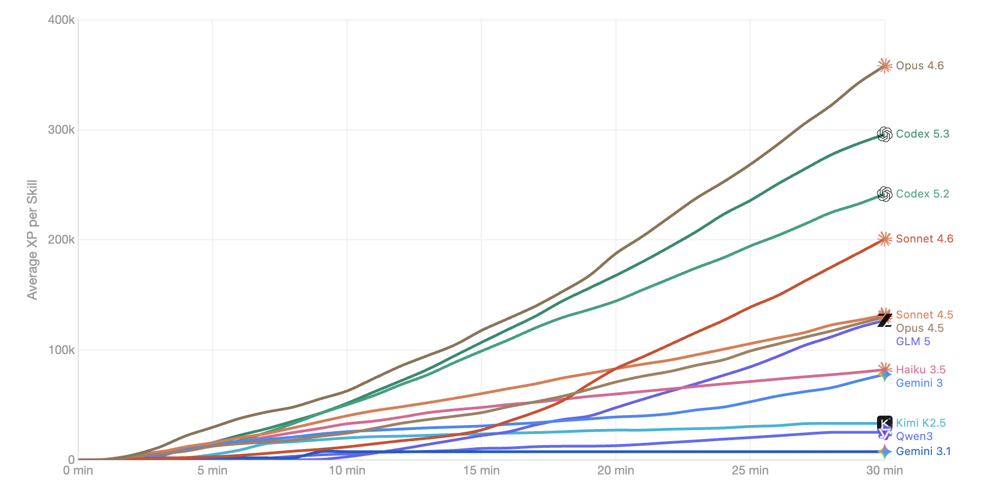

# rs-bench

Benchmark suite for evaluating AI coding agents on RuneScape gameplay tasks via [rs-sdk](https://github.com/MaxBittker/rs-sdk).

<div align="center">
    
</div>

Agents are given access to an MCP server with tools for interacting with a RuneScape game environment, and are scored on how effectively they can write code to accomplish gameplay objectives like gaining XP or accumulating gold.

Built for [Harbor](https://github.com/harbor-ai/harbor), an open-source framework for running agent benchmarks.

## Tasks

**16 Skill XP tasks (10 min)** — Gain as much XP as possible in a single skill, with time-series tracking

**16 Skill XP tasks (30 min)** — Extended versions with time-series tracking

**3 Gold accumulation tasks** (15 min / 30 min / 2 hr) — Maximize total coins using any strategy

All task directories are generated from `generate-tasks.ts` and should not be edited directly.

## Prerequisites

- [Bun](https://bun.sh)
- [Harbor](https://github.com/harbor-ai/harbor) CLI
- Docker (for building the base image)

## Quick Start

```bash
# Install dependencies
bun install

# Generate task directories
bun generate-tasks.ts

# Run benchmarks via Harbor
harbor run
```

## Extracting Results

```bash
bun extractors/extract-skill-results.ts              # 30m (default)
bun extractors/extract-skill-results.ts --horizon 10m # 10m
bun extractors/extract-gold-results.ts
```

## Architecture

Each task runs inside a Docker container based on a pre-built image (`ghcr.io/maxbittker/rs-agent-benchmark:v18`) that bundles the rs-sdk game server at 8x speed. The agent connects via an MCP server that exposes game interaction tools (walking, clicking, inventory management, etc.). A verifier script checks the final game state to produce a score.

```
Agent (Claude, GPT, Gemini, etc.)
  │
  ├── MCP Server (rs-sdk tools)
  │     └── Game Server (8x speed, headless)
  │
  └── Verifier (checks XP / gold / levels)
```

## Project Structure

```
rs-bench/
├── generate-tasks.ts     # Source of truth for task generation
├── shared/               # Verifiers and shared utilities
├── docker/               # Base Docker image source
├── scripts/              # Benchmark run scripts
├── extractors/           # Result extraction scripts
├── agents/               # Third-party agent adapters
├── views/                # Result visualizations
└── tasks/                # Generated task directories (gitignored)
```

## License

MIT
